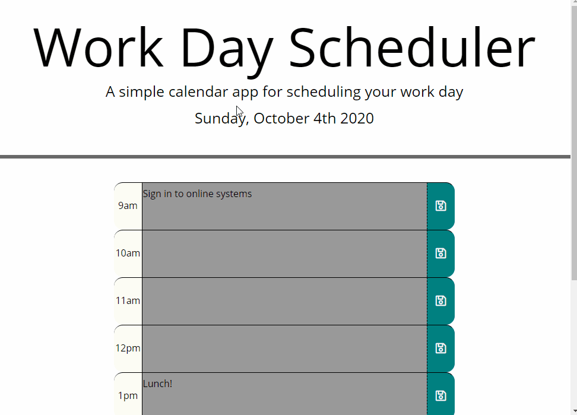

# DayToDayPlanner
Fifth homework assignment for uw-sea-fsf-pt-08-2020-u-c, [a simple day planner to save recurring daily tasks at work.][1]

## Table of Contents

* [Description](#description)
  * [Building the Planner](#building-the-planner)
  * [Finding the Right Moment(.js)](#finding-the-right-momentjs)
  * [Saving the Tasks](#saving-the-tasks)
  * [Built With](#built-with)
* [Contact](#contact)

## Description 
For this assignment, we were asked to create a simple planner that would store tasks for each hour in localStorage. The tasks persist each day, so a user can track recurring daily items or leave themselves a reminder for the next day.

### Building the Planner
The only page elements kept in the page's HTML are the header and a section for the planner to populate - everything else is dynamically added using jQuery. To effectively save data for each hour block, I used an array containing an object for each block. The program checks if a user already has a saved array in their localStorage, and if they do it loads that data. Otherwise, it provides a default array with time blocks from 9am to 5pm and three example tasks.

Once the array to use has been decided, the program loops through each object and creates a row to match. Each row contains a label for the time block, a text area (populated with any existing tasks), and a button to let users save their changes. The object's index is noted in each text area and save button, to accommodate later accessing that index to save new tasks.

### Finding the Right Moment(.js)
We were instructed to use Moment.js for this project to help us become more familiar with using third-party APIs. Moment provides an easy way to find the current date and time, then perform calculations on it. (Moment's documentation talks a bit about why it's been discontinued and recommends other libraries to be used in its place, but the issues listed weren't anything that would affect this program.)

For this project, I used Moment to populate the date at the top of the screen, to label each time block, and to test whether each block was in the past, present, or future. The assignment requested that any blocks in the past be color-coded gray, the present should be red, and the future should be green. In my schedule array each object includes a trait for its time, noted as the hour in 24-hour time. As each row of the planner is created, Moment parses that hour to make its label (9am, 12 pm, 3pm, etc) and my javascript mathematically compares it to the current hour. Each text area is then assigned a class that carries the relevant background color. These pieces, along with a matching save button, are then added to a new row on the page.

### Saving the Tasks
When a user clicks the save button for a given hour, that hour's text area (and no other line) is updated in the schedule array and saved in localStorage. This specificity is achieved by storing a data element on each text area and its matching save button with the block's index in the schedule array. With how jQuery's click handling makes use of the "this" keyword, the button's data element is easily pulled to make sure the correct text area is saved to the schedule array. Then, the whole array is saved into localStorage so the information will persist into a new session the next day.

### Built With

* jQuery
* Moment.js
* JavaScript
* Bootstrap
* HTML
* CSS

## Contact

Zii (Christina) Engelhardt - cjengelhardt@gmail.com

Project Link: [https://ziieng.github.io/DayToDayPlanner/](https://ziieng.github.io/DayToDayPlanner/)

Repository Link: [https://github.com/ziieng/DayToDayPlanner](https://github.com/ziieng/DayToDayPlanner)

[1]:<https://ziieng.github.io/DayToDayPlanner/>
